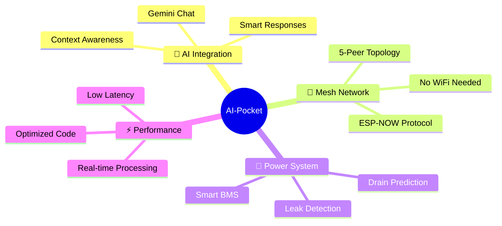
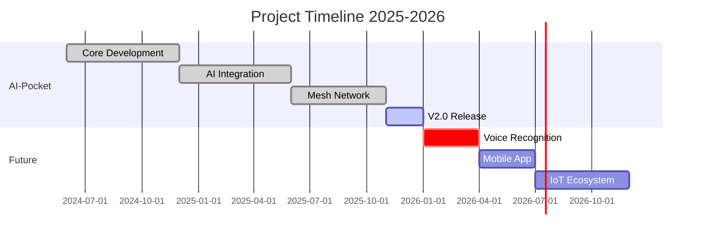

# Hi 👋 I'm Sanzx Project

<div align="center">


<p>
  
</p>

### 🌟 Turning Ideas Into Reality, One Line of Code at a Time

[](https://github.com/sanzxprojectid)
[](https://github.com/sanzxprojectid?tab=followers)
[](https://github.com/sanzxprojectid?tab=repositories)

</div>

<div align="center">

### 🌐 Connect With Me

[](https://instagram.com/sanzx_project.id)
[](https://www.tiktok.com/@sanzx_project.id)
[](https://github.com/sanzxprojectid)
[](mailto:sanzxproject@gmail.com)

</div>


<br>

## 🚀 About Me

<div align="center">

### 👨‍💻 Embedded Systems Engineer | 🤖 IoT Enthusiast | 🌟 Open Source Contributor

</div>

<table align="center">
<tr>
<td width="50%" valign="top">

#### 🎯 What I Do

```cpp
class SanzxProject {
  private:
    String passion = "Building Smart Devices";
    int yearsOfExperience = 3;
    bool loveCoding = true;
    
  public:
    void introduce() {
      Serial.println("👋 Hello World!");
      Serial.println("I'm a hardware hacker");
      Serial.println("& software creator");
      Serial.println("from Indonesia 🇮🇩");
    }
    
    void mission() {
      while(loveCoding) {
        learn();
        build();
        share();
      }
    }
};
```

</td>
<td width="50%" valign="top">

#### 🔥 Currently Working On

🤖 **AI-Pocket Project**
> ESP32-C3 AI assistant with mesh networking

📡 **ESP-NOW Research**
> Building reliable P2P communication

🔋 **Power Optimization**
> Advanced battery management systems

#### 💡 Interests

- 🌐 IoT & Smart Home Automation
- 🧠 Edge AI & Machine Learning
- ⚡ Low-Power Circuit Design
- 📶 Wireless Communication Protocols
- 🎮 Interactive Device Interfaces

</td>
</tr>
</table>

<div align="center">

### 🛠️ My Tech Arsenal

<details>
<summary>🔧 <b>Hardware & Platforms</b></summary>
<br>

| Platform | Experience | Projects |
|----------|------------|----------|
| ESP32/ESP32-C3 | ⭐⭐⭐⭐⭐ | AI-Pocket, Mesh Networks |
| Arduino | ⭐⭐⭐⭐⭐ | Sensor Systems, Automation |
| Raspberry Pi | ⭐⭐⭐⭐ | Edge Computing, Servers |
| STM32 | ⭐⭐⭐ | Motor Control, Industrial |

</details>

<details>
<summary>💻 <b>Programming Languages</b></summary>
<br>

```text
C/C++      ████████████████████░  95%  - Embedded Systems
Python     ███████████████░░░░░  75%  - Automation & AI
JavaScript ████████████░░░░░░░░  60%  - Web Integration
Assembly   ██████░░░░░░░░░░░░░░  30%  - Low-level Optimization
```

</details>

<details>
<summary>🌐 <b>Communication Protocols</b></summary>
<br>

✅ **Wireless**: WiFi, Bluetooth, ESP-NOW, LoRa  
✅ **Wired**: UART, I2C, SPI, CAN Bus  
✅ **Internet**: MQTT, HTTP/HTTPS, WebSocket  
✅ **Network**: TCP/IP, UDP, Mesh Networking  

</details>

<details>
<summary>🤖 <b>AI & Cloud Services</b></summary>
<br>

- 🧠 Google Gemini API Integration
- ☁️ Firebase & Cloud IoT
- 📊 TensorFlow Lite (Edge AI)
- 🗣️ Voice Recognition Systems

</details>

</div>

<div align="center">

### 📫 Want to Collaborate?

```cpp
void collaborate() {
  if (you.have("Cool IoT Idea") || you.want("Learn ESP32")) {
    reach.out("Let's build something amazing! 🚀");
    project.status = EXCITED;
  }
}
```

**💬 I'm always open to:**  
`Interesting Projects` • `Tech Discussions` • `Knowledge Sharing` • `Open Source Contributions`

</div>

---

## 🔥 Featured Project

<div align="center">


### 🤖 AI-Pocket: The Future of Pocket Computing

<table>
<tr>
<td width="60%">

**🚀 ESP32-C3 Powered AI Assistant**

The most advanced pocket multitool with bleeding-edge features that push the boundaries of what's possible on microcontrollers!

#### ✨ Key Features



#### 🎯 What Makes It Special

- 💬 **AI Chat Interface** - Talk to Gemini AI offline
- 🌐 **Mesh Networking** - Connect 5+ devices seamlessly
- 🔋 **Intelligent Battery** - Predicts runtime & optimizes power
- ⌨️ **Custom Input** - Responsive keyboard system
- 🎮 **Interactive UI** - Smooth OLED animations
- 🧘 **Zen Mode** - Focus timer & productivity tools

</td>
<td width="40%">


<br>

[](https://github.com/sanzxprojectid/AI-pocket)
[](https://github.com/sanzxprojectid/AI-pocket/fork)
[](https://github.com/sanzxprojectid/AI-pocket/issues)
[](https://github.com/sanzxprojectid/AI-pocket/blob/main/LICENSE)

<br>

```cpp
// Quick Start
git clone AI-pocket.git
cd AI-pocket
pio run -t upload
// Enjoy the future! 🚀
```

<br>

**[📖 Documentation](https://github.com/sanzxprojectid/AI-pocket) • [🐛 Report Bug](https://github.com/sanzxprojectid/AI-pocket/issues) • [💡 Request Feature](https://github.com/sanzxprojectid/AI-pocket/issues)**

</td>
</tr>
</table>


</div>

---

## 💻 Tech Stack & Expertise

<div align="center">


</div>

<table align="center">
<tr>
<td width="33%" align="center">

### 🔧 Hardware & Embedded


**Expertise Level**
```
ESP32 Series    ████████████ 98%
Arduino         ████████████ 95%
Raspberry Pi    ██████████░░ 85%
STM32           ████████░░░░ 75%
```

</td>
<td width="33%" align="center">

### 💻 Programming & Tools


**Proficiency**
```
C/C++           ████████████ 98%
Python          ██████████░░ 80%
JavaScript      ████████░░░░ 70%
Assembly        ██████░░░░░░ 55%
```

</td>
<td width="33%" align="center">

### 🌐 IoT & Communication


**Protocol Mastery**
```
ESP-NOW         ███████████░ 92%
WiFi/BLE        ██████████░░ 88%
MQTT            █████████░░░ 85%
LoRa            ███████░░░░░ 68%
```

</td>
</tr>
</table>

<details>
<summary><b>🛠️ Development Tools & Frameworks (Click to expand)</b></summary>
<br>

<div align="center">

| Category | Tools |
|----------|-------|
| **IDEs** | VS Code • PlatformIO • Arduino IDE • STM32CubeIDE |
| **Version Control** | Git • GitHub • GitLab |
| **Design** | Fusion 360 • KiCad • Fritzing • EasyEDA |
| **Testing** | Logic Analyzer • Oscilloscope • Multimeter |
| **Protocols** | I2C • SPI • UART • CAN Bus • Modbus |
| **Libraries** | ESP-IDF • Arduino Core • FreeRTOS • TensorFlow Lite |
| **Cloud & AI** | Google Gemini • Firebase • AWS IoT • TensorFlow |

</div>

</details>

<div align="center">

### 🎯 Specialized Skills

<table>
<tr>
<td align="center" width="20%">

<br><b>AI Integration</b>
<br><sub>Edge AI • Gemini API</sub>
</td>
<td align="center" width="20%">

<br><b>Mesh Networks</b>
<br><sub>ESP-NOW • P2P</sub>
</td>
<td align="center" width="20%">

<br><b>Power Systems</b>
<br><sub>BMS • Optimization</sub>
</td>
<td align="center" width="20%">

<br><b>IoT Solutions</b>
<br><sub>Smart Devices</sub>
</td>
<td align="center" width="20%">

<br><b>Firmware Dev</b>
<br><sub>Bare Metal • RTOS</sub>
</td>
</tr>
</table>

</div>

---

## 📊 GitHub Analytics Dashboard

<div align="center">

### ⚡ Performance Metrics

<table>
<tr>
<td align="center" width="50%">


</td>
<td align="center" width="50%">


</td>
</tr>
</table>

### 💻 Code Distribution


### 📈 Contribution Activity


</div>

---

## 🏆 Achievements & Milestones

<div align="center">


</div>

<table align="center">
<tr>
<td align="center" width="25%">

<br><b>500+</b>
<br><sub>Lines of Code Daily</sub>
</td>
<td align="center" width="25%">

<br><b>10+</b>
<br><sub>Major Projects</sub>
</td>
<td align="center" width="25%">

<br><b>100+</b>
<br><sub>Community Members</sub>
</td>
<td align="center" width="25%">

<br><b>Open</b>
<br><sub>To Collaborate</sub>
</td>
</tr>
</table>

---

## 🎯 Current Focus & Roadmap

<div align="center">

### 🚀 What I'm Building Right Now

</div>

<table>
<tr>
<td width="50%" valign="top">

#### ⚡ Active Development



#### 🔬 Research Areas

- 🧠 **Edge AI Optimization** - Running ML models on ESP32
- 📡 **Mesh Topology** - Building self-healing networks
- 🔋 **Energy Harvesting** - Solar + kinetic power systems
- 🎮 **UI/UX Design** - Smooth interfaces on OLED displays

</td>
<td width="50%" valign="top">

#### 🎯 2025-2026 Goals

<details open>
<summary><b>Q4 2025 (Oct - Dec) - CURRENT</b></summary>

- [x] ✅ Complete AI-Pocket mesh networking
- [x] ✅ Optimize battery management system
- [ ] 🔄 Launch AI-Pocket v2.0 (In Progress)
- [ ] 📝 Write technical documentation
- [ ] 🎥 Create YouTube tutorials

</details>

<details>
<summary><b>Q1 2026 (Jan - Mar)</b></summary>

- [ ] 🎤 Add voice recognition feature
- [ ] 📱 Start companion mobile app development
- [ ] 🌐 Build web dashboard prototype
- [ ] 🤝 Open source contributions
- [ ] 🏆 Attend tech conferences

</details>

<details>
<summary><b>Q2-Q3 2026 (Apr - Sep)</b></summary>

- [ ] 🏠 Complete IoT ecosystem
- [ ] 📚 Launch online course
- [ ] 🎓 Technical blog series
- [ ] 🌟 Reach 1000 GitHub stars
- [ ] 🤖 AI wearable prototype

</details>

#### 💡 Dream Projects

```cpp
vector<Project> dreamList = {
  {"Smart Home Hub", "Central IoT controller"},
  {"Wearable AI Assistant", "ESP32 smartwatch"},
  {"Env Monitor", "Air quality sensor network"},
  {"Robot Arm", "6-DOF manipulator"},
  {"Energy Monitor", "Real-time power analytics"}
};
```

</td>
</tr>
</table>

<div align="center">

### 🌱 Learning & Growth

| Area | Current Status | Next Milestone |
|------|----------------|----------------|
| 🔌 **ESP-NOW Protocol** | `██████████████ 95%` | Multi-hop routing |
| 🤖 **Edge AI** | `████████████░░ 80%` | Model quantization |
| 🔋 **Power Management** | `██████████████ 95%` | Energy harvesting |
| 📊 **Data Visualization** | `████████░░░░░░ 55%` | Web dashboard |
| 🌐 **Cloud Integration** | `██████████░░░░ 70%` | AWS IoT Core |
| 🎨 **PCB Design** | `███████████░░░ 75%` | 4-layer boards |

</div>

---

## 📈 Weekly Development Activity

<div align="center">

<!--START_SECTION:waka-->
```text
💻 This Week's Coding Stats

C/C++        ████████████████░░░░░   65.2%  (12 hrs 45 mins)
Python       ████░░░░░░░░░░░░░░░░   17.8%  (3 hrs 28 mins) 
Markdown     ███░░░░░░░░░░░░░░░░░   11.5%  (2 hrs 15 mins)
JSON         █░░░░░░░░░░░░░░░░░░░    3.8%  (45 mins)
Other        ░░░░░░░░░░░░░░░░░░░░    1.7%  (20 mins)

🔥 Productivity: ████████████░░ 75% | 🎯 Focus: Embedded Systems
```
<!--END_SECTION:waka-->

</div>

---

## 💬 Let's Connect & Collaborate!

<div align="center">


<br>

### 🤝 Open to Collaboration

<table>
<tr>
<td width="50%" align="center">

#### 🌟 I'm Looking For

```cpp
struct Collaboration {
  bool openSource = true;
  bool learningTogether = true;
  bool innovativeIdeas = true;
  
  bool interestedIn() {
    return (coolIoTProjects || 
            embeddedChallenges ||
            AIintegration ||
            meshNetworks ||
            batteryOptimization);
  }
};

// Let's build something amazing! 🚀
```

**💡 Areas of Interest:**
- 🤖 IoT & Smart Device Projects
- 🧠 AI/ML on Embedded Systems
- 📡 Wireless Communication Protocols
- 🔋 Energy-Efficient Design
- 🎓 Knowledge Sharing & Tutorials

</td>
<td width="50%" align="center">

#### 📬 Get In Touch

<a href="https://instagram.com/sanzx_project.id">
  
</a>

<a href="https://www.tiktok.com/@sanzx_project.id">
  
</a>

<a href="https://github.com/sanzxprojectid">
  
</a>

<a href="mailto:sanzxproject@gmail.com">
  
</a>

<br><br>

**⚡ Quick Links**

[](https://github.com/sanzxprojectid)
[](https://github.com/sanzxprojectid)
[](https://www.linkedin.com)

<br>

**📍 Based in Padang, West Sumatra, Indonesia 🇮🇩**

</td>
</tr>
</table>

<br>

### 💭 Response Time

| Platform | Typical Response |
|----------|------------------|
| 📧 Email | Within 24 hours |
| 📱 Instagram DM | Within 12 hours |
| 🐙 GitHub Issues | Within 48 hours |
| 🎵 TikTok Comments | Daily check |

<br>


</div>

---

<br>

<div align="center">


### 💡 "Innovation distinguishes between a leader and a follower." - Steve Jobs

<br>

**⭐ If you like my projects, consider giving them a star!**

<br>


<br>


<br>

---

<sub>🚀 **Building the future, one commit at a time** | 💻 **Powered by caffeine & curiosity** | ⚡ **Making hardware smart since 2021**</sub>

</div>
