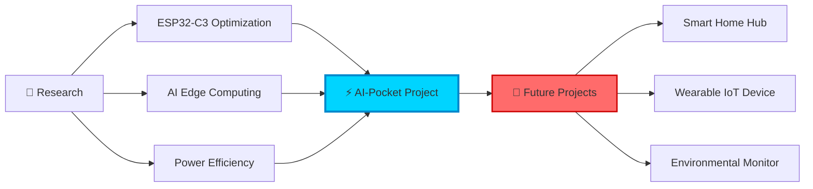

# Hi 👋 I'm Sanzx Project

<p align="center">
  
</p>

<p align="center">
  
  
  
</p>

<p align="center">
  <a href="https://instagram.com/sanzx_project.id">
    
  </a>
  <a href="https://www.tiktok.com/@sanzx_project.id">
    
  </a>
  <a href="https://github.com/sanzxprojectid">
    
  </a>
</p>

---

## 🚀 About Me

<div align="center">

### 👨‍💻 Embedded Systems Engineer | 🤖 IoT Enthusiast | 🌟 Open Source Contributor

</div>

<table align="center">
<tr>
<td width="50%" valign="top">

#### 🎯 What I Do

```cpp
class SanzxProject {
  private:
    String passion = "Building Smart Devices";
    int yearsOfExperience = 3;
    bool loveCoding = true;
    
  public:
    void introduce() {
      Serial.println("👋 Hello World!");
      Serial.println("I'm a hardware hacker");
      Serial.println("& software creator");
      Serial.println("from Indonesia 🇮🇩");
    }
    
    void mission() {
      while(loveCoding) {
        learn();
        build();
        share();
      }
    }
};
```

</td>
<td width="50%" valign="top">

#### 🔥 Currently Working On

🤖 **AI-Pocket Project**
> ESP32-C3 AI assistant with mesh networking

📡 **ESP-NOW Research**
> Building reliable P2P communication

🔋 **Power Optimization**
> Advanced battery management systems

#### 💡 Interests

- 🌐 IoT & Smart Home Automation
- 🧠 Edge AI & Machine Learning
- ⚡ Low-Power Circuit Design
- 📶 Wireless Communication Protocols
- 🎮 Interactive Device Interfaces

</td>
</tr>
</table>

<div align="center">

### 🛠️ My Tech Arsenal

<details>
<summary>🔧 <b>Hardware & Platforms</b></summary>
<br>

| Platform | Experience | Projects |
|----------|------------|----------|
| ESP32/ESP32-C3 | ⭐⭐⭐⭐⭐ | AI-Pocket, Mesh Networks |
| Arduino | ⭐⭐⭐⭐⭐ | Sensor Systems, Automation |
| Raspberry Pi | ⭐⭐⭐⭐ | Edge Computing, Servers |
| STM32 | ⭐⭐⭐ | Motor Control, Industrial |

</details>

<details>
<summary>💻 <b>Programming Languages</b></summary>
<br>

```text
C/C++      ████████████████████░  95%  - Embedded Systems
Python     ███████████████░░░░░  75%  - Automation & AI
JavaScript ████████████░░░░░░░░  60%  - Web Integration
Assembly   ██████░░░░░░░░░░░░░░  30%  - Low-level Optimization
```

</details>

<details>
<summary>🌐 <b>Communication Protocols</b></summary>
<br>

✅ **Wireless**: WiFi, Bluetooth, ESP-NOW, LoRa  
✅ **Wired**: UART, I2C, SPI, CAN Bus  
✅ **Internet**: MQTT, HTTP/HTTPS, WebSocket  
✅ **Network**: TCP/IP, UDP, Mesh Networking  

</details>

<details>
<summary>🤖 <b>AI & Cloud Services</b></summary>
<br>

- 🧠 Google Gemini API Integration
- ☁️ Firebase & Cloud IoT
- 📊 TensorFlow Lite (Edge AI)
- 🗣️ Voice Recognition Systems

</details>

</div>

<div align="center">

### 📫 Want to Collaborate?

```cpp
void collaborate() {
  if (you.have("Cool IoT Idea") || you.want("Learn ESP32")) {
    reach.out("Let's build something amazing! 🚀");
    project.status = EXCITED;
  }
}
```

**💬 I'm always open to:**  
`Interesting Projects` • `Tech Discussions` • `Knowledge Sharing` • `Open Source Contributions`

</div>

---

## 🔥 Featured Project

<div align="center">

### 🤖 [AI-Pocket](https://github.com/sanzxprojectid/AI-pocket)

[](https://github.com/sanzxprojectid/AI-pocket)
[](https://github.com/sanzxprojectid/AI-pocket/fork)
[](https://github.com/sanzxprojectid/AI-pocket/issues)
[](https://github.com/sanzxprojectid/AI-pocket/blob/main/LICENSE)

**A powerful ESP32-C3 multitool with AI integration, mesh networking, and advanced battery management**

🤖 Gemini AI Chat • 📡 ESP-NOW Mesh • 🔋 Battery Guardian • ⚡ Power Monitor • 🧮 Calculator • 🧘 Zen Mode

[View Project →](https://github.com/sanzxprojectid/AI-pocket)

</div>

---

## 💻 Tech Stack

### 🔧 Embedded Systems


### 💬 Programming Languages


### 🛠️ Tools & Technologies


### 🌐 IoT & Communication


### 🤖 AI & APIs


---

## 📊 GitHub Statistics

<p align="center">
  
  
</p>

<p align="center">
  
</p>

<p align="center">
  
</p>

---

## 🏆 GitHub Trophies

<p align="center">
  
</p>

---

## 🎯 Current Focus



---

## 📌 Pinned Repositories

<p align="center">
  <a href="https://github.com/sanzxprojectid/AI-pocket">
    
  </a>
</p>

---

## 💡 Project Highlights

| 🤖 AI Integration | 📡 Mesh Network | 🔋 Power Management |
|-------------------|-----------------|---------------------|
| Google Gemini AI on ESP32 | ESP-NOW P2P Messaging | Advanced Battery Analytics |
| Real-time chat interface | 5-peer mesh topology | Drain rate prediction |
| Custom keyboard system | No WiFi required | Leak detection |

---

## 🌱 Learning Journey

| Area | Status | Focus |
|------|--------|-------|
| 🔌 ESP-NOW Protocol | ████████░░ 80% | Mesh optimization |
| 🤖 AI Edge Computing | ██████░░░░ 60% | Model compression |
| 🔋 Battery Management | ████████░░ 85% | Predictive analytics |
| 📊 Data Visualization | ████░░░░░░ 40% | OLED graphics |
| 🌐 Web Integration | ███░░░░░░░ 30% | RESTful APIs |

---

## 📈 Coding Activity

<!--START_SECTION:waka-->
```text
C/C++        12 hrs 45 mins  ████████████████░░░░░   65.2%
Python        3 hrs 28 mins  ████░░░░░░░░░░░░░░░░░   17.8%
Markdown      2 hrs 15 mins  ███░░░░░░░░░░░░░░░░░░   11.5%
JSON          0 hrs 45 mins  █░░░░░░░░░░░░░░░░░░░░    3.8%
Other         0 hrs 20 mins  ░░░░░░░░░░░░░░░░░░░░░    1.7%
```
<!--END_SECTION:waka-->

---

## 🎨 Skills Matrix

```ascii
╔══════════════════════════════════════════════╗
║  Embedded Systems    [██████████] 95%       ║
║  IoT Development     [█████████░] 90%       ║
║  C/C++ Programming   [█████████░] 88%       ║
║  Hardware Design     [████████░░] 80%       ║
║  AI Integration      [███████░░░] 70%       ║
║  Battery Systems     [█████████░] 85%       ║
║  Wireless Protocols  [████████░░] 82%       ║
║  PCB Design          [██████░░░░] 60%       ║
╚══════════════════════════════════════════════╝
```

---

## 🔭 Future Goals

- [ ] 🚀 Launch AI-Pocket v2.0 with voice recognition
- [ ] 🌐 Build comprehensive IoT ecosystem
- [ ] 📱 Develop mobile companion app
- [ ] 🤝 Collaborate on open-source embedded projects
- [ ] 📚 Create video tutorials for ESP32 development
- [ ] 🏆 Contribute to major embedded systems libraries
- [ ] 🎓 Share knowledge through technical blog posts

---

## 💬 Let's Connect!

<p align="center">
  <i>I'm always open to interesting projects and collaboration opportunities!</i>
</p>

<p align="center">
  <a href="https://instagram.com/sanzx_project.id">
    
  </a>
  <a href="https://www.tiktok.com/@sanzx_project.id">
    
  </a>
  <a href="https://github.com/sanzxprojectid">
    
  </a>
</p>

---

## 🐍 Contribution Snake

<picture>
  <source media="(prefers-color-scheme: dark)" srcset="https://raw.githubusercontent.com/sanzxprojectid/sanzxprojectid/output/github-contribution-grid-snake-dark.svg">
  <source media="(prefers-color-scheme: light)" srcset="https://raw.githubusercontent.com/sanzxprojectid/sanzxprojectid/output/github-contribution-grid-snake.svg">
  
</picture>

---

<div align="center">
  
### 💡 "Innovation distinguishes between a leader and a follower." - Steve Jobs


**Thanks for visiting! Happy coding! 🚀**


</div>
